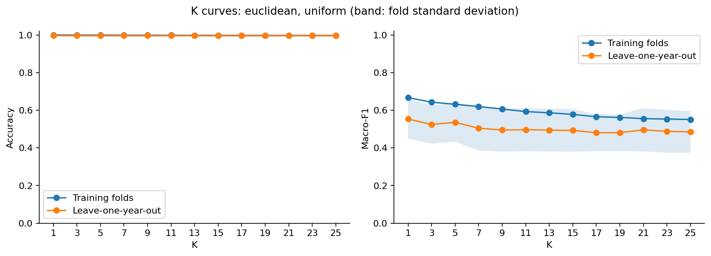
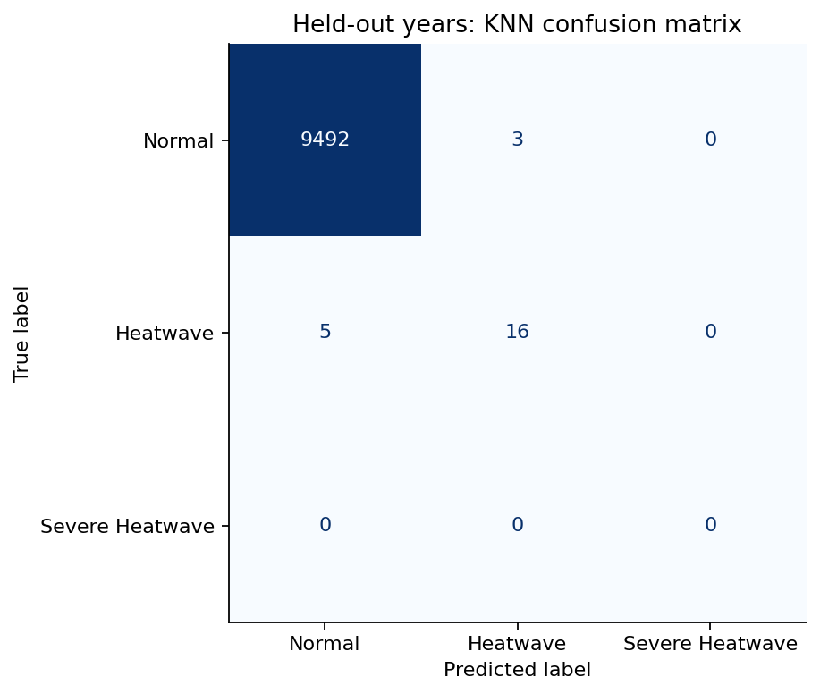
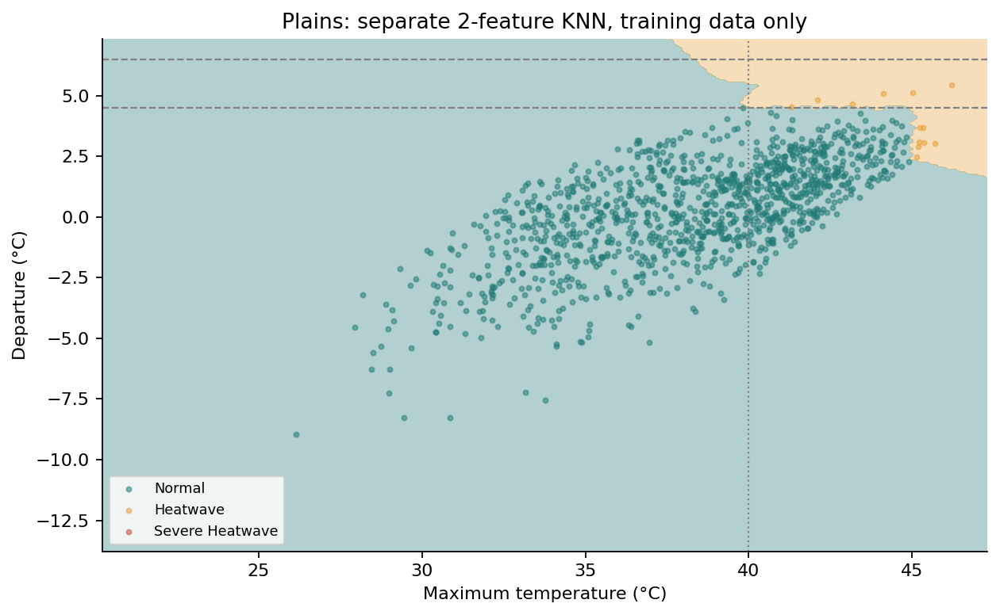
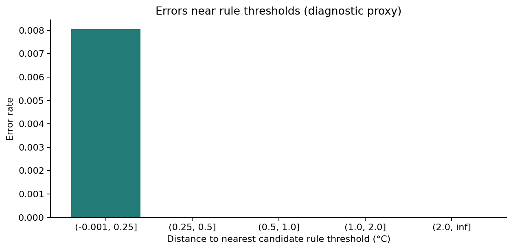
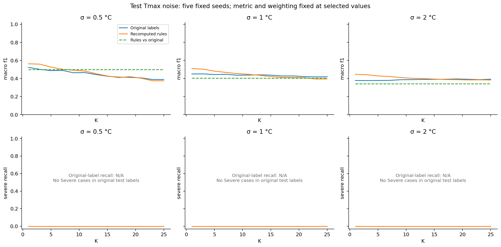

# Heatwave Severity Classification with KNN

Machine Learning (216H13C501), Exp8 extension. Use case: KJS-CES-01, Climate Intelligence for Heatwave Monitoring, Prediction, and Early Warning. Team: three members (names to be entered by the team).

## Abstract

This project classifies the same day's Maharashtra grid-cell temperature into Normal, Heatwave or Severe Heatwave using K-nearest neighbours. Real IMD annual files for 1991–2025 yield 26 grid centres and 34,892 March–June modelling observations. KNN achieves test macro-F1 0.5999 against a majority baseline of 0.3330, using a fixed three-class scoring convention. No Severe observations occur in either split, so Severe recall is unavailable and the fitted classifier cannot predict that class. This is a material limitation of the requested three-class experiment.

## 1. Objective and interpretation

The high KNN performance is expected because the target labels are generated from two of the model's input variables. The experiment therefore evaluates how effectively KNN approximates our operational decision boundaries, not independent forecasting capability.

The target is same-day severity, not future heatwave onset. The modelling technique is KNN only. The majority baseline is a constant training-majority reference. Geographic error structure, K sensitivity and noisy readings provide the analysis value. No independent observed heatwave declarations validate the labels.

## 2. Data and inspection

Source: [IMD yearly 1° maximum-temperature binary archive](https://www.imdpune.gov.in/cmpg/Griddata/Max_1_Bin.html). The live form listed 2025 and its file downloaded successfully. The annual format is a 31×31 grid, latitude 7.5–37.5°N, longitude 67.5–97.5°E, daily float32 values in day/latitude/longitude order. Files contain 365 or 366 days. The parser uses little-endian values, checks byte lengths and plausible temperature ranges, and converts 99.9 to missing. Byte order is an implementation finding, not a claim from IMD's documentation. SHA-256 hashes and URLs are in `data/raw/manifest.json`.

Cell centres must fall inside the Maharashtra polygon. The boundary comes from geoBoundaries, attributed to DataMeet India community and the Election Commission of India, with its CC BY 2.5 India license and pinned source URL preserved in `data/boundaries/source.json`. The polygon's represented year is 2011. This produces 26 cells, rather than a bounding-box approximation. Partial cells whose centres fall outside are excluded.

No modelling rows were dropped for missing temperatures in this acquired dataset (0 recorded). The complete annual baseline is loaded, including the required February 22–July 7 margins. The coarse grid smooths local extremes and cannot represent station-level variation. IMD notes that data from 2008 onward use fewer operationally available stations.

## 3. Climatological normal

For each cell and fixed non-leap calendar day, pool finite Tmax observations within ±7 calendar days across 1991–2014. Divide their sum by the number of finite observations. This is a 15×24 observation pool when complete. February 29 is excluded, and the window wraps on a 365-day calendar. The normal differs from IMD's official normal. Baseline years precede all train and test years. Missing values reduce the denominator rather than biasing equal-day averages.

## 4. Operational Heatwave Severity Rules (Project Approximation)

A cell must meet its base temperature: plains ≥40°C, coastal ≥37°C or hilly ≥30°C. Below the base the label is Normal. Above it, departures ≥4.5°C and <6.5°C indicate Heatwave, and departures ≥6.5°C indicate Severe Heatwave. When normal temperature is ≥40°C, Tmax ≥45°C indicates Heatwave and Tmax ≥47°C indicates Severe Heatwave. The higher applicable severity wins.

These rules are our operationalisation and have not been verified against IMD's published criteria. They apply to a grid cell on one day, omitting station-level and consecutive-day declaration criteria. Region types use our own geographic assignment, not IMD's seven regions.

### Class counts immediately after labeling

| label | train | test |
| --- | --- | --- |
| Normal | 25234 | 9495 |
| Heatwave | 142 | 21 |
| Severe Heatwave | 0 | 0 |

The Severe class has zero support in both splits. Training provides no Severe neighbours, so the deployed KNN cannot output Severe. With the fixed three-class macro-F1 convention, even perfect predictions of observed classes have a maximum macro-F1 of 2/3. Zero-support class metrics in raw sklearn tables are placeholders, not measured Severe performance. Severe recall is explicitly N/A here and in the headline evaluation. There are only 21 Heatwave test observations, so one error changes Heatwave recall by approximately 4.76 percentage points. The team should review task feasibility before presenting this as a complete three-class classifier. We retain the locked split and rules, and disclose this limitation rather than altering them after seeing test results.

The lookup in `data/region_lookup.csv` uses this transparent project proxy: longitude <74°E is coastal; 74≤longitude<75°E and latitude<20°N is hilly; remaining cells are plains. It is a coarse location proxy without elevation or coastline-distance validation. It needs team review. Changing it requires relabeling and rerunning all results.

## 5. Pipeline and experiment

The single saved scikit-learn Pipeline takes date, latitude, longitude, region type, Tmax and normal Tmax. FeatureBuilder recomputes departure and maps month/day to 2001 to obtain day-of-year. Seasonal features are sin(2π·doy365/365) and cos(2π·doy365/365), making March 1 day 60 in leap and non-leap years alike.

StandardScaler fits Tmax, departure, sine, cosine, latitude and longitude. OneHotEncoder transforms region type without scaling and rejects unknown categories. KNN is the final step. The shared package prevents app/notebook preprocessing drift.

Training years are 2015–2022 and testing years are 2023–2025. Leave-one-year-out validation uses eight training folds. Each fold refits the entire pipeline. Search includes K=1,3,…,25, Euclidean/Manhattan distance, and uniform/distance weighting (52 configurations). Selection uses macro-F1 over the explicit labels Normal, Heatwave, Severe. There is no resampling. NumPy seeds for noise are fixed.

Selected parameters: **K=1, euclidean, uniform weighting**. Cross-validated macro-F1: **0.5533**. Deterministic first-in-grid ordering resolves exact ties.

### Top grid-search configurations

| Item | param_knn__n_neighbors | param_knn__metric | param_knn__weights | mean_test_macro_f1 | mean_test_accuracy |
| --- | --- | --- | --- | --- | --- |
| 0 | 1 | euclidean | uniform | 0.5533 | 0.9970 |
| 1 | 1 | euclidean | distance | 0.5533 | 0.9970 |
| 27 | 1 | manhattan | distance | 0.5531 | 0.9969 |
| 26 | 1 | manhattan | uniform | 0.5531 | 0.9969 |
| 31 | 5 | manhattan | distance | 0.5391 | 0.9966 |
| 3 | 3 | euclidean | distance | 0.5381 | 0.9965 |
| 30 | 5 | manhattan | uniform | 0.5373 | 0.9965 |
| 5 | 5 | euclidean | distance | 0.5363 | 0.9964 |
| 4 | 5 | euclidean | uniform | 0.5356 | 0.9963 |
| 7 | 7 | euclidean | distance | 0.5354 | 0.9964 |

The complete 52-row table is `results/grid_search.csv`.

Figure 1. Training-fold versus leave-one-year-out accuracy and macro-F1 with Euclidean distance and uniform weighting. Bands show fold standard deviation, not confidence intervals. Uniform weighting avoids the trivial self-neighbour training scores of distance weighting.

## 6. Held-out results

| Item | macro_f1 | severe_recall | accuracy | severe_support |
| --- | --- | --- | --- | --- |
| KNN | 0.5999 | N/A | 0.9992 | 0.0000 |
| Majority baseline | 0.3330 | N/A | 0.9978 | 0.0000 |

### KNN per-class metrics

| Item | precision | recall | f1-score | support |
| --- | --- | --- | --- | --- |
| Normal | 0.9995 | 0.9997 | 0.9996 | 9495.0000 |
| Heatwave | 0.8421 | 0.7619 | 0.8000 | 21.0000 |
| Severe Heatwave | N/A | N/A | N/A | 0.0000 |

The baseline always predicts the most common training class. Its per-class table is in `results/baseline_report.csv`. Year-specific metrics are in `results/metrics_by_year.csv`. Accuracy alone would obscure the rare Heatwave cases, while Severe performance cannot be estimated at all.

Figure 3. Confusion matrix with all three classes retained, including the zero-support Severe row and column.

Figure 4. A separate two-feature KNN fitted on plains training observations only illustrates Tmax/departure decision regions. This is not a slice of the deployed model. Background combinations may lie outside observed support. Reference lines show departure and base thresholds.

Figure 5. Error rate by distance to the nearest candidate rule threshold. This proxy includes temperature, departure and normal-temperature gates. It is not exact distance to the active piecewise boundary, so use it as a descriptive diagnostic.

| threshold_band | observations | errors | error_rate |
| --- | --- | --- | --- |
| (-0.001, 0.25] | 995.0000 | 8.0000 | 0.0080 |
| (0.25, 0.5] | 890.0000 | 0.0000 | 0.0000 |
| (0.5, 1.0] | 1684.0000 | 0.0000 | 0.0000 |
| (1.0, 2.0] | 2005.0000 | 0.0000 | 0.0000 |
| (2.0, inf] | 3942.0000 | 0.0000 | 0.0000 |

## 7. Noise robustness

Gaussian noise with σ=0.5,1,2°C perturbs only test Tmax. Normal temperature remains fixed. The shared pipeline recomputes departure, and the shared labeling function recomputes rule labels. For each K, selected metric and weighting remain fixed and fitting uses only the original training set. Five fixed seeds (11,23,37,51,71) give paired perturbations across K.

Figure 6. Mean macro-F1 and Severe recall over five seeds. Predictions versus original labels measure stability. Predictions versus recomputed rules measure rule fidelity. Noisy rules versus original labels provide the reference for target changes alone. Gaps in Severe curves mean undefined recall with no Severe ground truth. If noise creates Severe labels, recall against recomputed rules can be zero because training contained no Severe samples.

### Selected K noise results

| Item | k | macro_f1 | severe_recall |
| --- | --- | --- | --- |
| (0.5, 'Original labels') | 1.0000 | 0.5229 | N/A |
| (0.5, 'Recomputed rules') | 1.0000 | 0.5625 | 0.0000 |
| (0.5, 'Rules vs original') | 1.0000 | 0.4978 | N/A |
| (1.0, 'Original labels') | 1.0000 | 0.4496 | N/A |
| (1.0, 'Recomputed rules') | 1.0000 | 0.5092 | 0.0000 |
| (1.0, 'Rules vs original') | 1.0000 | 0.4034 | N/A |
| (2.0, 'Original labels') | 1.0000 | 0.3777 | N/A |
| (2.0, 'Recomputed rules') | 1.0000 | 0.4452 | 0.0000 |
| (2.0, 'Rules vs original') | 1.0000 | 0.3420 | N/A |

All K/σ means and per-seed values are in `results/noise_mean.csv` and `results/noise_by_seed.csv`; standard deviations are in `results/noise_summary.csv`. These experiments evaluate sensitivity to artificial independent reading noise, not realistic forecast uncertainty, instrument calibration error or correlated weather errors. Noise outcomes do not retune the model.

## 8. Streamlit demonstration

The user supplies date, location, Tmax and normal Tmax. Dates are restricted to March–June and coordinates are checked against the Maharashtra boundary. A haversine nearest-cell lookup supplies region type. The app displays computed departure, KNN severity, the project rule label, neighbour class counts and weighted vote shares. Zero-distance neighbours follow sklearn's voting convention. Vote shares are not calibrated confidence probabilities. A visible warning explains missing Severe training support. Evaluation tabs show notebook-generated figures.

## 9. Reproducibility and verification

`requirements.txt` pins library versions, including scikit-learn 1.6.1; the editable heatwave package has version 0.1.0. The artifact dictionary stores pipeline, label_map, input_columns and sklearn_version. Loading rejects version mismatches. The custom transformer remains importable from heatwave.pipeline. The notebook verifies 20 held-out inputs after loading in a fresh process and compares the app's prediction path.

Tests cover label boundaries, leap calendars, pooled normals, exclusion of future years, parser shape/orientation, fold-specific scaling, artifact/version contracts and neighbour voting. Commands to reproduce the complete flow appear in the README. All figures and tables in this report are produced by `notebooks/analysis.ipynb`; no manual metric edits are required.

## 10. Limitations and next decisions

The dataset contains no Severe target examples and very few Heatwave examples. A three-class learning claim is therefore unsupported. The approved design can be demonstrated computationally, but class feasibility remains a team decision. A wider period or different resolution would require a documented protocol revision. Do not change thresholds or test years silently.

Labels derive from model inputs, the normal is project-specific, region types are approximate, the grid is coarse, and no independent declarations or future-weather target are used. Spatial correlation among cells and temporal correlation among days mean row counts overstate independent evidence. The split avoids fitting on future years but does not test transfer to unseen geography. Results apply only to the specified data, lookup and decision rules.

## 11. Ownership

Person 1: acquisition, normals, labels, region lookup and class counts. Person 2: pipeline, tuning, evaluation, noise analysis and artifact. Person 3: Streamlit, report and presentation. All members review the missing Severe class and geographic proxy before submission.

## References

- IMD, yearly 1° Tmax archive: https://www.imdpune.gov.in/cmpg/Griddata/Max_1_Bin.html
- Srivastava, A. K., Rajeevan, M., and Kshirsagar, S. R. (2009), Development of High Resolution Daily Gridded Temperature Data Set (1969–2005) for the Indian Region, Atmospheric Science Letters. DOI: 10.1002/asl.232.
- geoBoundaries India ADM1 metadata: https://www.geoboundaries.org/api/current/gbOpen/IND/ADM1/ . Underlying source and attribution: DataMeet India community, Election Commission of India; CC BY 2.5 India. Exact source URL is saved with the boundary.
- User-supplied Final Design Spec, revision 2, included as `reports/design_spec.md`.
